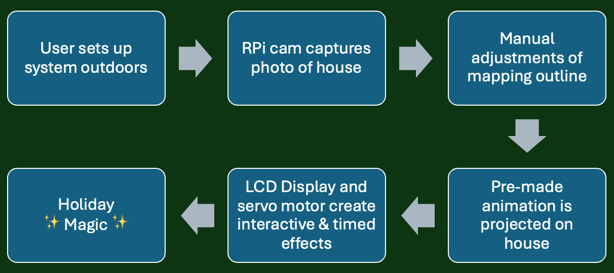

# christmas
cd existing_repo
git remote add origin https://gitlab.oit.duke.edu/coston_individual2_aipi590/coston_individual2_aipi590.git
git branch -M main
git push -uf origin main
# Christmas in a Box

A festive, plug-and-play projection mapping system that lights up your home—without the hassle, cost, or danger of traditional holiday lights.

## 📌 Table of Contents
Introduction  
Features  
Hardware & Software Requirements  
Installation & Setup  
How It Works  
Challenges  
Next Steps  
Acknowledgments  
License  

## 📝 Introduction
This project is a holiday light projection mapping system built using a Raspberry Pi, camera, and mini projector housed inside a themed “gingerbread house” container. It captures the shape of a house and overlays light animations—bringing joy utilizing computer vision.

### 💡 Why This Matters?

Hanging outdoor holiday lights is time-consuming and risky

Hiring professionals is expensive

This system offers a safer, fun, and automated alternative using computer vision and projection mapping

This project runs locally on a Raspberry Pi for low-cost, real-time processing.

### 🔹 Features
✔️ Automatically detects house shape using Pi Camera
✔️ Projects holiday lights and animations without physical setup
✔️ Portable "Christmas in a Box" housing
✔️ Interactive servo-powered features (e.g., sliding door, LCD display, holiday audio jingle)
✔️ Runs entirely on a Raspberry Pi  

## 💻 Hardware & Software Requirements
### 🔧 Hardware:
Raspberry Pi 4  
Mini Projector  
Pi Camera  
Continuous Servo Motor (for gingerbread house door)  
Button (to capture photo)  
Button (to open/close door)  
LED Display  
Real-time Clock Module  
Containment device (custom-built gingerbread house enclosure)  
USB Cable, HDMI Cable, Power Supply (5V Battery Pack), Wires, Breadboard  

### 📦 Software:
Python 3.7+    
NumPy  
OpenCV  
VLC (for video projection demo)  
Roboflow  
Window Object Detection Dataset for computer vision model (Project ID: door-window-detection-pipvh-xcnsz)  
Roof & Trim Instance Segmentation Dataset for computer vision model (Project ID: dzinlyinstancesegmentation-welbr)  

## ⚙️ Installation & Setup
### Step 1: Clone the Repository
git clone https://gitlab.oit.duke.edu/coston_individual2_aipi590/coston_individual2_aipi590.git 
cd christmas 

### Step 2: Install Dependencies
pip install -r requirements.txt  

### Step 3: Hardware Assembly
Connect Pi Camera to Raspberry Pi via ribbon  
Connect Mini Projector to Raspberry Pi via HDMI cable  
Connect buttons, RTC module, passive buzzer, and LCD display using GPIO pins  
Create track for door to run on servo motor (.stl files for 3D printed rack & pinion; can choose between two sizes of pinions)  
Secure all components inside your chosen [e.g., gingerbread house] enclosure (.svg files for laser cut gingerbread house)  

### Step 4: Run the Program
Press the button to demo the system (will open/close door via servo)  
Press the second button and camera captures and maps the projection area  
Light animation video plays through the projector     

## 📊 How It Works
User sets up the “Christmas in a Box” facing their house  
Press button → servo opens door → projector lens revealed  
Pi Camera captures house image  
OpenCV detects edges or key shapes (windows, roofline)  
Light animation is aligned to contours and projected  
Servo and buzzer add interactive, festive effects :)  

### 📌 Flowchart of the System:

## 🚧 Challenges
🔴 IR Blaster Integration  
Initially planned for IR-controlled lights but ran into signal issues; feature was skipped in final build.

🔴 Containment Device Design  
Multiple iterations on how to house all components—limited space and aesthetics were hard to balance.

🔴 Servo Timing & Constraints  
Servo motor movement had to be extremely precise within the tight enclosure space.

🔴 Projection Alignment Issues  
Accurate projection mapping onto the house was challenging—OpenCV had trouble with lighting variation and inconsistent surfaces.

## 🚀 Next Steps
✔️ Improve projection alignment accuracy  
✔️ Add customizable light themes and interactive modes  
✔️ Find a work-around IR or wireless syncing with external light devices  
✔️ Upgrade detection system for better edge and feature detection  
✔️ Add mobile or voice control for convenience  

## 📜 License
This project is licensed under the MIT License – feel free to use and modify it.
